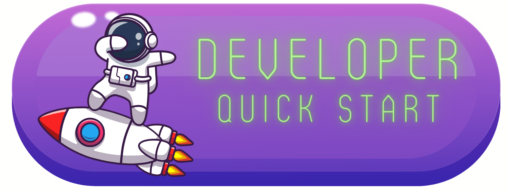

===================================
Welcome to POC for the Hyperledger LMWG Taskforce!
===================================

A Proof of Concept / Tutorial Page to dive into the customization options and reStructured Syntax for a ReadTheDocs page. 
===================================

 
.. image:: 1.png
   :height: 114.75px
   :width: 300px 
   :scale: 100 %
   :alt: alternate text
   :align: left
   :target: https://wiki.hyperledger.org/display/LMDWG

   
 
.. note::

   This project is under active development.
   
.. note::

   This project is under active development.
.. note2:: 

   This is a second note2

   
Contents
--------

.. toctree::

   usage
   api

Lumache has its documentation hosted on Read the Docs.
